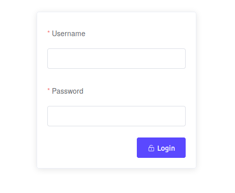
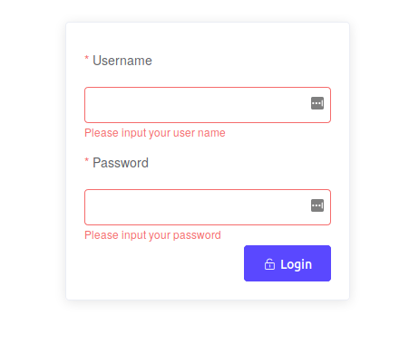

# Vue Element Login view
A simple Vue.js login view with simple validation, created with components from the Element Vue.js 2.0 UI Toolkit.



## Dependencies
Vue Js 2.0 - [https://vuejs.org/](https://vuejs.org/)

Element 2.12 - [https://element.eleme.io/](https://element.eleme.io/)

## How to use it?
Just copy the code into your Vue.JS project and setup `dispatch actions` according to your store.

### Dispatching Actions

```javascript
created() {
    // reset login status
    this.$store.dispatch("authentication/logout");  // Target your store action here 
},
 ...
if (username && password) {
    dispatch("authentication/login", { username, password });  // Target your store action
}
...
```
### Optional "Remember me" checkbox
To display the "Remember me" checkbox, uncomment the following code: 

```javascript
<el-form-item prop="type">
    <el-checkbox label="Remember me" name="type"></el-checkbox>
</el-form-item>
```

### Validation
The view also implements simple validation for missing data in the form inputs.



## License

This project is licensed under the The Unlicense License - see the [LICENSE](LICENSE) file for details

## Authors

* **Bence Hajdu** - [GitHub - benhajdu](https://github.com/benhajdu)